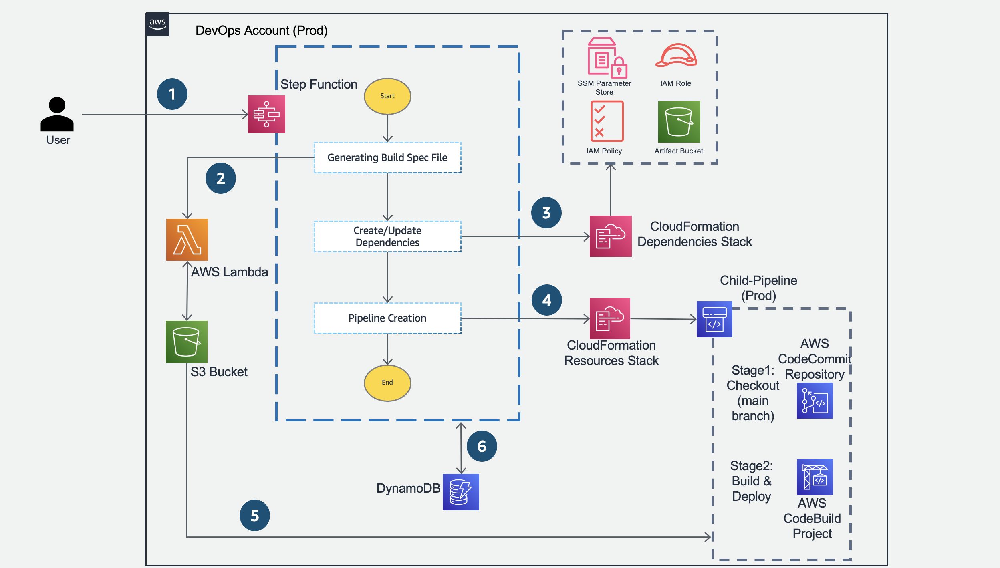

© 2023 Amazon Web Services, Inc. or its affiliates. All Rights Reserved.
This work is licensed under a Creative Commons Attribution 4.0 International License.

# Automated CI Pipeline Creation

## Summary

As the technology stack diversifies and the volume of development activities increases, Organisations find it difficult to have standardised CI Pipelines leveraging the AWS developer tools and AWS best practices.

This pattern depicts the creation of Continuous Integration pipelines dynamically using an AWS Step Function based approach to create standardised pipelines for an organisation. This approach ensures that all pipelines in the organisation are consistent and standardised. The solution takes the technology stack (java, python) , pipeline name, stages required for the pipeline etc., as input and generates the CI pipelines leveraging AWS Step Functions, AWS Lambda, AWS CloudFormation, Amazon S3 and Amazon DynamoDB.

## **Prerequisites**

-   An AWS account.

-   S3 bucket to maintain the templates required by this solution.

-   An IAM user with required permissions to setup the solution for creation of pipelines using CloudFormation.

## **Limitations**

-   The AWS IAM Roles used in this solution follows the principle of least privilege and is configured with the minimum access for this platform to function. The role should be updated as per requirement.

-   This solution currently supports the automated creation of CI pipelines for Java and Python projects only.

## **Target architecture**

The workflow of the above architecture is as follows:

1.  A user provides the input parameters in JSON format to start execution of the Step Function.

2.  Based on the provided inputs, the Lambda function reads the references which is available in S3 Bucket and it generates the BuildSpec.yaml file which is written back to the S3 Bucket.

    This generated buildspec.yaml defines the stages of the CI Pipeline.

3.  Step Function checks for any creation or updates to the dependencies for the pipeline to be created and performs the required action as needed.

4.  The Step Function then creates the pipeline resources as a CloudFormation stack

5.  The sample source-code for the selected technology stack along with generated buildspec.yaml file will be pushed into CodeCommit Repository which is then used by the pipeline.

6.  DynamoDB will be used for storing the pipeline details and its status during the execution of the solution.

## **Tools**

-   [AWS Step Function](https://aws.amazon.com/step-functions/) - AWS Step Functions is a visual workflow service that helps developers use AWS services to build distributed applications, automate processes, orchestrate micro services, and create data and machine learning (ML) pipelines.

-   [AWS Lambda](https://aws.amazon.com/lambda/) - AWS Lambda is a serverless, event-driven compute service that lets you run code for virtually any type of application or backend service without provisioning or managing servers. You can trigger Lambda from over 200 AWS services and software as a service (SaaS) applications, and only pay for what you use.

-   [AWS CodeBuild](https://aws.amazon.com/codebuild/) – AWS CodeBuild is a fully managed continuous integration service that compiles source code, runs tests, and produces software packages that are ready to deploy.

-   [AWS CodeCommit](https://aws.amazon.com/codecommit/) – AWS CodeCommit is a fully-managed source-control service that hosts secure Git-based repositories

-   [AWS CodePipeline](https://aws.amazon.com/codepipeline/) – AWS CodePipeline is a fully managed continuous delivery service that helps you automate your release pipelines for fast and reliable application and infrastructure updates.

-   [AWS Identity and Access Management (IAM)](https://aws.amazon.com/iam/) – AWS IAM helps you to manage access to AWS services and resources securely.

-   [AWS KMS – AWS Key Management Service (AWS KMS)](https://aws.amazon.com/kms/) – AWS KMS helps to create and manage cryptographic keys and control their use across a wide range of AWS services and in your applications.

-   [Amazon S3](https://aws.amazon.com/s3/) – Amazon Simple Storage Service (Amazon S3) is storage for the internet.

-   [AWS CloudFormation](https://docs.aws.amazon.com/AWSCloudFormation/latest/UserGuide/Welcome.html) - AWS CloudFormation is a service that helps you model and set up your AWS resources so that you can spend less time managing those resources and more time focusing on your applications that run in AWS.

-   [Amazon DynamoDB](https://aws.amazon.com/dynamodb/) - Amazon DynamoDB is a fully managed, serverless, key-value NoSQL database designed to run high-performance applications at any scale. DynamoDB offers built-in security, continuous backups, automated multi-Region replication, in-memory caching, and data import and export tools.

-   [SSM Parameter Store](https://docs.aws.amazon.com/systems-manager/latest/userguide/systems-manager-parameter-store.html) - Parameter Store, a capability of AWS Systems Manager, provides secure, hierarchical storage for configuration data management and secrets management. You can store data such as passwords, database strings, Amazon Machine Image (AMI) IDs, and license codes as parameter values.

-   [Python](https://www.python.org/) - Python is a programming language that lets you work quickly and integrate systems more effectively.

## Best practices

-   If Secrets are involved in a pipeline or action configuration, such as tokens or passwords, do not enter secrets directly in the action configuration or CloudFormation configuration because the information will be displayed in the logs. Use Secrets Manager to set up and store secrets, and then reference this secret in the pipeline or action configuration as needed.

-   Configure server-side encryption for artifacts stored in Amazon S3 for CodePipeline by managing AWS KMS keys. Refer  [documentation](https://docs.aws.amazon.com/codepipeline/latest/userguide/S3-artifact-encryption.html)

-   Ensure Principal of least Privilege while setting up IAM roles to be used by the Pipelines

-   Ensure that your Amazon S3 buckets use the correct policies and are not publicly accessible

-   Use versioning to preserve, retrieve, and restore every version of every object stored in your Amazon S3 bucket.

-   Use IAM Access Analyzer to perform checks and get actionable recommendations to help you author secure and functional policies.

-   To the extent that it's practical, define the conditions under which your IAM policies allow access to a resource.

-   Enable logging and monitoring

-   Review the tests results to find those that are routinely ignored can identify potential for streamlining your test coverage.

## Solution Deployment

1. Creation of S3 bucket for maintaining the templates used by this solution
    - Login to the AWS Account and Navigate to the S3 service page.
    - Create a S3 bucket for hosting the Cloud Formation templates, Source Code and input files. For the detailed instructions for creating S3 bucket refer the [documentation](https://docs.aws.amazon.com/AmazonS3/latest/userguide/creating-bucket.html)
        -  Note: This can be ignored if the bucket is already available

2. Clone the Code Repository from GitLab to the local workstation
    - Copy the HTTPS/SSH URL from the same repository i.e., "aws-dlp-automated-ci-pipeline-creation"
    - Open the terminal on your local system and run the below commands,

        -  mkdir working-directory
        -  cd working-directory
        -  git clone < HTTPS/SSH that you copied in previous step>

3. Upload the Solution templates and artifacts into the S3 bucket
    - Login to the AWS Account and navigate to the S3 console.
    - Select the S3 Bucket which you have created in pre-requisite step for storing the solution templates.
    - Copy the contents from the Solution-Templates folder which you cloned locally and upload them into the S3 bucket.
        -  Note: Copy only the contents within the folder “Solution-Templates“

4. Create the CloudFormation stack for deploying the solution resources for CI pipeline creation
    - Sign into the AWS Management Console and navigate to the AWS CloudFormation service console.
    - Click on **Create stack** and in the drop down select **With new resources (standard)**
    - In the next screen, under **Specify template** section select **Upload a template file**
    - Select **Choose file** and navigate to the root folder of the cloned GitLab repository in your local workstation and select **template.yml** and click on **Open**
    - Click **Next**
    - In the Specify stack details, provide the details,
      -  **S3TemplateBucketName** - Name of the S3 bucket to which the template zip files, source code and input files where uploaded to.
      -  **DynamoDBTable** - Name of the DynamoDBTable that you want to create with
      -  **StateMachineName** - Name of the State Machine that you want to create with

    - In the Configure stack options click **Next**
    - In the Review page **select the check box** to acknowledge and click **Create Stack**.
      -  Wait for the stack to show CREATE_COMPLETE status and the main pipeline components are now successfully

## Support
Tell people where they can go to for help. It can be any combination of an issue tracker, a chat room, an email address, etc.

## Authors and acknowledgment
- Aromal Raj Jayarajan
- Amarnath Reddy Patnam
- Mahesh Raghunandanan
- Vijesh Vijayakumaran Nair

## Project status
If you have run out of energy or time for your project, put a note at the top of the README saying that development has slowed down or stopped completely. Someone may choose to fork your project or volunteer to step in as a maintainer or owner, allowing your project to keep going. You can also make an explicit request for maintainers.

## Security

See [CONTRIBUTING](CONTRIBUTING.md#security-issue-notifications) for more information.

## License

This library is licensed under the MIT-0 License. See the LICENSE file.

